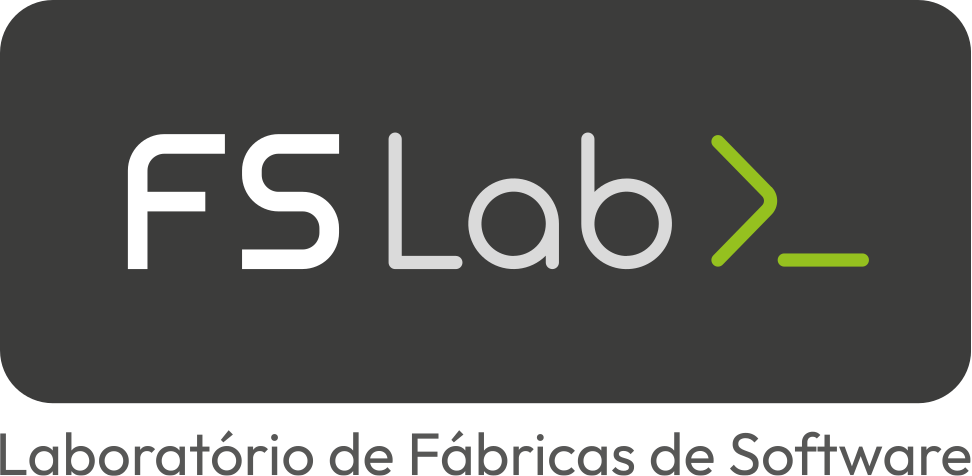

<p align="center">
  
</p>
<br>
<h1 align="center">🎓 Academia FSLab</h1>
<p align="center">
   A Academia FSLab é a plataforma oficial de cursos desenvolvida para a Fábrica de Software do IFRO.
</p>

---

## 📑 Sumário

- [🚀 Projeto](#projeto)
- [🌐 Acesse a Academia em produção](#acesse-a-academia-em-produção)
- [✨ Funcionalidades](#funcionalidades)
- [🛠 Tecnologias Utilizadas](#tecnologias-utilizadas)
- [📂 Estrutura de Pastas](#estrutura-de-pastas)
- [▶️ Como Rodar Localmente](#como-rodar-localmente)
- [🔐 Variáveis de Ambiente](#variáveis-de-ambiente)
- [👨‍💻 Autor](#autor)

---

## 🚀 Projeto

Aplicação frontend da Academia FSLab desenvolvida com **Next.js 14** (App Router).  
O projeto oferece uma interface responsiva para:

- Realizar login e recuperação de senha
- Acessar cursos e assistir conteúdos
- Gerar e visualizar certificados
- Editar informações do perfil do usuário
- Verificar e validar certificados

---

## 🌐 Acesse a Academia em produção:
🔗 https://academia.app.fslab.dev

---

## ✨ Funcionalidades

- Autenticação com NextAuth
- Player de vídeo integrado (YouTube Player e certificado)
- Upload e recorte de imagens para perfil
- Gerenciamento de curso com sidebar interativa
- Página de recuperação de senha e verificação de e-mail
- Edição de perfil com foto
- Emissão e visualização de certificados com assinatura digital
- Testes de ponta a ponta com Cypress

---

## 🛠 Tecnologias Utilizadas

- **Next.js 14** – App Router
- **React.js**
- **Tailwind CSS**
- **NextAuth.js** – Autenticação
- **React Query** – Gerenciamento de requisições
- **Zod** – Validação de formulários
- **Cypress** – Testes E2E
- **Docker** – Deploy e CI/CD
- **Shadcn/ui** – Componentes UI reutilizáveis

---

## 📂 Estrutura de Pastas

```
academia-fslab-frontend/
├── components/
├── cypress/
├── lib/ 
├── public/assets/ 
├── src/
│ ├── actions/
│ ├── app/ 
│ ├── context/ 
│ ├── errors/ 
│ ├── providers/ 
│ ├── schemas/ 
│ └── utils/ 
├── .dockerignore
├── .env 
├── .env.example
├── .gitignore
├── .gitlab-ci.yml
├── components.json
├── cypress.config.js
├── cypress.env.json
├── cypress.env.json.example
├── deployment.yaml
├── Dockerfile 
├── jsconfig.json
├── next.config.mjs
├── package-lock.json
├── package.json
├── postcss.config.js
└── README.md
├── tailwind.config.js
````
---

## ▶️ Como Rodar Localmente

```bash
# 📦 Clone o repositório
git clone ssh://git@gitlab.fslab.dev:4241/academia-fslab/academia-fslab-front-end.git

# 💻 Acesse o diretório do projeto
cd academia-fslab-front-end

# 📥 Instale as dependências
npm install

# ⚙️ Configure as variáveis de ambiente
cp .env.example .env
nano .env   # edite conforme necessário

# 🛠️ Build o projeto
npm run dev

# 🚀 Inicie a aplicação
npm start

> academia-fslab-front-end@0.1.0 start
> next start

   ▲ Next.js 14.1.3
   - Local:        http://localhost:3000
```

---

## 🔐 Variáveis de Ambiente

Crie um arquivo `.env` com o seguinte conteúdo:

```env
API_URL=
NEXT_PUBLIC_API_URL=
NEXT_PUBLIC_FRONT_URL=

NEXTAUTH_URL=
NEXTAUTH_SECRET=

NEXT_PUBLIC_LIMITE_UPLOAD_ARQUIVOS=

EXPOSE_PORT=3000
```

---

## 👨‍💻 Autor
<p align="center"> 
    <a href="https://github.com/pablosmolak"> 
    <br/> 
    Pablo Smolak </a> 
</p> 

<br>
<p align="center">🧪 Projeto desenvolvido como parte do Trabalho de Conclusão de Curso 🚀</p>